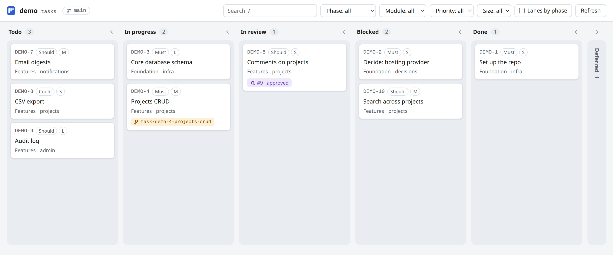
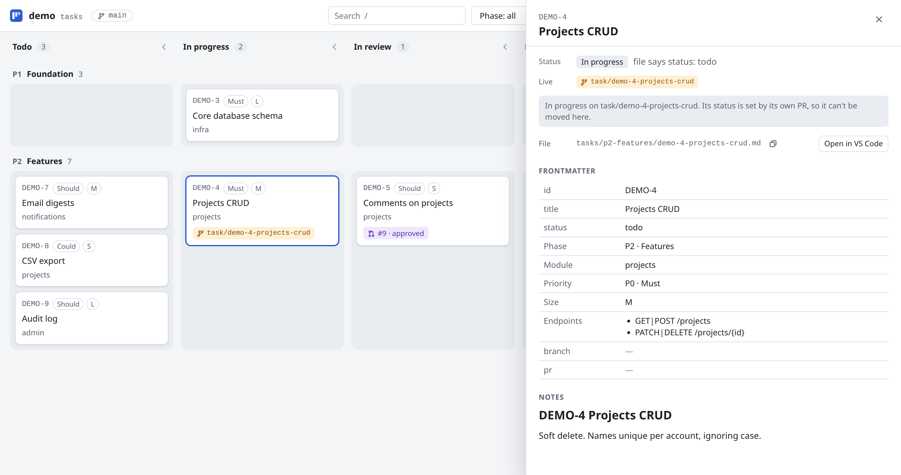

# board.md

A local web board for the markdown task files already in your repo, with live git branch and pull
request state.



board.md is a tool, not a file format. You keep one markdown file per task, with YAML frontmatter
in whatever shape you already use. A small config file tells the board which fields mean what, and
`boardmd serve` shows the tasks as columns on localhost:

- **Your files as they are.** Nothing to convert or migrate.
- **Live git state.** A local branch for a task shows it as in progress, and an open pull request
  shows it as in review, with draft, approved and changes-requested labels. This is worked out
  each time the board loads; nothing is written to your files or committed.
- **Drag to change status.** Only the `status:` line changes, so the git diff is one line.

It suits repos where a coding agent keeps the task files: the board reads the agent's files as
they are and shows its branches and pull requests as they happen.

## Quick start

You need Node 20 or later. git and the [GitHub CLI](https://cli.github.com) (`gh`, signed in) are
optional: without them the board still works, just without branch and PR state.

**1. Install it** as a dev dependency of your repo:

```bash
npm install --save-dev board.md
```

With pnpm, use `pnpm add -D board.md` (add `-w` at the root of a pnpm workspace).

**2. Add `boardmd.config.json`** at the root of your repo. This is the smallest config that works.
Point `tasksDir` at your task files, and list the statuses your files use:

```json
{
  "tasksDir": "docs/tasks",
  "id": { "field": "id" },
  "statuses": ["todo", "in-progress", "done"],
  "columns": [
    { "name": "Todo", "status": "todo" },
    { "name": "In progress", "status": "in-progress" },
    { "name": "Done", "status": "done" }
  ]
}
```

[Configuration](#configuration) covers the rest: badges, filters, swimlanes, and the `live` section
that turns on branch and PR state.

**3. Start the board** from the repo root:

```bash
npx boardmd serve --open
```

It prints the address (http://127.0.0.1:4600) and opens it in your browser. Stop it with
<kbd>Ctrl</kbd>+<kbd>C</kbd>. The page updates by itself while it runs, so you can leave it open.

**4. Optionally, add a script** to your `package.json`, so `npm run board` starts it:

```json
"scripts": {
  "board": "boardmd serve --open"
}
```

### Options

```
boardmd serve [--port 4600] [--open] [--offline] [--config boardmd.config.json]

  -p, --port     Port to listen on (default 4600)
  -o, --open     Open the board in a browser
      --offline  Skip git branch and GitHub PR lookups
  -c, --config   Config file (default boardmd.config.json)
```

The server listens on 127.0.0.1 only.

### If it doesn't start

- `config file not found`: run it from the folder that has `boardmd.config.json`, or pass
  `--config path/to/boardmd.config.json`.
- `boardmd.config.json: columns[2].status: ...`: the message names the key to fix.
- `Port 4600 is already in use`: another board (or app) is running; use `--port 4601`.
- Cards are missing: files that couldn't be read are listed at the top of the page, with the
  reason.

## Task files

Any `*.md` file under `tasksDir` (in any subfolder) with YAML frontmatter is a task:

```markdown
---
id: DEMO-4
title: Projects CRUD
status: todo
phase: P2
module: projects
priority: P0
size: M
endpoints:
  - GET|POST /projects
branch:
pr:
---

# DEMO-4 Projects CRUD

Soft delete. Names unique per account, ignoring case.
```

Files without frontmatter, with YAML that doesn't parse, without an id, or sharing an id with
another file are listed as invalid at the top of the page instead of stopping the board.

## Configuration

`boardmd.config.json`, at the root of your repo. It's JSON rather than JavaScript, so loading it
never runs code. The board checks it at startup and names the bad key if something is wrong.

```json
{
  "tasksDir": "docs/project/tasks",
  "id": { "field": "id", "pattern": "^DEMO-(\\d+)$", "template": "DEMO-{n}" },
  "titleField": "title",
  "statusField": "status",
  "statuses": ["todo", "in-progress", "blocked", "done", "deferred"],
  "columns": [
    { "name": "Todo", "status": "todo" },
    { "name": "In progress", "status": "in-progress", "live": ["in-progress"] },
    { "name": "In review", "live": ["in-review"] },
    { "name": "Blocked", "status": "blocked" },
    { "name": "Done", "status": "done" },
    { "name": "Deferred", "status": "deferred", "collapsed": true }
  ],
  "fields": {
    "phase": { "label": "Phase", "swimlane": true, "values": { "P1": "Foundation", "P2": "Features" } },
    "module": { "label": "Module", "filter": true },
    "priority": { "label": "Priority", "badge": true, "values": { "P0": "Must", "P1": "Should" } },
    "size": { "label": "Size", "badge": true },
    "endpoints": { "label": "Endpoints", "list": true }
  },
  "live": {
    "baseBranch": "main",
    "branchPattern": "^(?:task|docs|fix)/demo-(\\d+(?:-\\d+)*)-[a-z]",
    "rangePrefixes": ["docs/"],
    "branchField": "branch",
    "prField": "pr",
    "ignoreStatuses": ["done", "deferred"]
  },
  "checkCommand": "npm run -s check-tasks",
  "afterEditHint": "Commit status changes in their own PR."
}
```

| Key             | Meaning                                                                                                                                                                                                                                  |
| --------------- | ---------------------------------------------------------------------------------------------------------------------------------------------------------------------------------------------------------------------------------------- |
| `tasksDir`      | Folder of task files, relative to the config file. Read recursively.                                                                                                                                                                     |
| `id`            | `field` holds the id (default `id`). `pattern` extracts its number, used to sort cards. `template` turns a number found in a branch name back into an id; it's required when `live` is set.                                              |
| `titleField`    | Default `title`.                                                                                                                                                                                                                         |
| `statusField`   | Default `status`. The only field the board ever writes.                                                                                                                                                                                  |
| `statuses`      | Every allowed status. A drop must land on one of these.                                                                                                                                                                                  |
| `columns`       | In order. A column shows cards whose file has its `status`, or whose live state is in its `live` list (`in-progress`, `in-review`). Only columns with a `status` accept drops. Tasks whose status matches no column go in an extra "Other" column. |
| `fields`        | Extra frontmatter fields: `label`, display labels for `values`, and whether the field is a card `badge`, a `filter`, the `swimlane` (one field at most) or a `list`. Fields with `values`, badges and the swimlane are filters unless `filter` is `false`. |
| `live`          | How branches and PRs map to tasks (see below). Leave it out to switch live state off.                                                                                                                                                    |
| `checkCommand`  | Optional shell command, run in the config's folder after each edit. If it fails, its output is shown as a warning. It never blocks the edit.                                                                                              |
| `afterEditHint` | Text shown in the uncommitted-changes banner.                                                                                                                                                                                            |

## Live state

Live state applies to tasks whose status isn't in `live.ignoreStatuses`.

- **Local branches.** A branch that matches `branchPattern` names one or more task numbers,
  separated by `-`: `task/demo-27-login` names DEMO-27, and `task/demo-27-29-auth` names DEMO-27
  and DEMO-29. On a branch whose prefix is in `rangePrefixes`, two numbers more than one apart are
  a range: `docs/demo-1-10-tidy` names DEMO-1 to DEMO-10. Those tasks show as in progress.
- **Pull requests** come from `gh pr list`. A PR belongs to a task when its head branch names the
  task, its number equals the task's `prField`, or its head branch equals the task's
  `branchField`. An open PR puts the task in review (newest PR first), over a local branch.
- **Merged, file not updated.** When the task's own PR (`prField`) is merged into `baseBranch` but
  the file isn't done (or blocked, see `live.mergedIgnoreStatuses`), the card gets a badge and
  stays in its column, ready to be dragged to Done.

PR results are cached for a minute and refreshed in the background; the Refresh button fetches
them straight away. The page updates by itself when task files change on disk or a branch is
created, deleted or checked out.

## Editing



Drag a card to another column, or focus it and press <kbd>M</kbd> to pick a column from a menu.

- Cards in progress on a branch or in review are locked: their status changes in their own PR.
- The edit sends the file's version with it. If the file changed on disk since the page loaded,
  nothing is written and the card reloads.
- Only the value on the `status:` line changes, keeping the key, spacing, quotes, any comment and
  the line ending (LF or CRLF). A file without a `status:` line is refused, not invented.
- The file is written atomically (a temporary file renamed over the original).
- If you're not on `baseBranch`, the page warns you before the first edit.
- A banner lists task files with uncommitted changes. Committing is up to you; the board never runs
  git commands that change anything.

Click a card (or press <kbd>Enter</kbd>) for its details: the rendered markdown, the frontmatter,
the file path with a copy button and an Open in VS Code link. Search, filters, swimlanes and the
open task are kept in the URL, so a view can be bookmarked. <kbd>/</kbd> focuses search, arrow keys
move between cards and <kbd>Esc</kbd> closes things.

## Security

The server writes files, so even on localhost it:

- answers only requests whose `Host` is `localhost:<port>` or `127.0.0.1:<port>` (this blocks DNS
  rebinding);
- accepts writes only with a random token created at startup and embedded in the page, and an
  `Origin` header that matches;
- finds files by task id from its own index, never from a path sent by the page;
- renders task markdown with raw HTML escaped and only `http`, `https` and `mailto` links, under a
  strict Content Security Policy.

## Development

```bash
pnpm install
pnpm test        # Vitest
pnpm typecheck
pnpm build       # dist/cli.js and dist/web/
```

The page is plain JavaScript and CSS in `src/web/`, copied into `dist/web/` by the build, so
installing the package pulls in no front-end dependencies. `test/fixtures/basic/` holds a made-up
project in the reference format. [HANDOVER.md](HANDOVER.md) has the original plan.

## License

[MIT](LICENSE)
