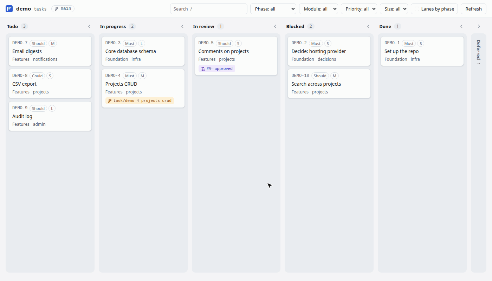

# board.md

A local web board for the markdown task files already in your repo, with live git branch and pull
request state.



board.md is a tool, not a file format. You keep one markdown file per task, with YAML frontmatter
in whatever shape you already use. A small config file tells the board which fields mean what, and
`boardmd serve` shows the tasks as columns on localhost:

- **Your files as they are.** Nothing to convert or migrate.
- **Live git state.** A local branch for a task shows it as in progress, and an open pull request
  shows it as in review, with draft, approved and changes-requested labels. This is worked out
  each time the board loads; nothing is written to your files or committed.
- **Drag to change status.** Only the `status:` line changes, so the git diff is one line.
- **Built for coding agents.** `boardmd list`, `new`, `set` and `check` let an agent read, create
  and update tasks safely, and `boardmd init` tells the repo's agents (CLAUDE.md, AGENTS.md, a
  Claude Code skill) how.

It suits repos where a coding agent keeps the task files: the board reads the agent's files as
they are and shows its branches and pull requests as they happen. Why it exists:
[My coding agents don't need a project management tool. They need markdown files.](https://dev.to/anojanst/my-coding-agents-dont-need-a-project-management-tool-they-need-markdown-files-2m0i)

## Quick start

You need Node 20 or later. git and the [GitHub CLI](https://cli.github.com) (`gh`, signed in) are
optional: without them the board still works, just without branch and PR state.

**1. Install it** as a dev dependency of your repo:

```bash
npm install --save-dev board.md
```

With pnpm, use `pnpm add -D board.md` (add `-w` at the root of a pnpm workspace).

**2. Set it up** from the root of your repo:

```bash
npx boardmd init
```

It finds your task files, works out a config from them, shows you what it found, and asks before
writing anything:

```
Found 88 task files in docs/project/tasks
  ids        TUI-1 … TUI-88 (the "id" field)
  new tasks  docs/project/tasks/<phase folder>/tui-<n>-<slug>.md
  statuses   todo, in-progress, blocked, done, deferred
  columns    Todo · In progress · In review · Blocked · Done · Deferred
  fields     phase (swimlanes); priority, size (badges); module (filters); endpoints (lists)
  live       branches like task/tui-12-…, PRs from gh, base branch main (2 local branches match now)

Use docs/project/tasks as the tasks folder? (Y/n)
Write boardmd.config.json? (Y/n)
Add a "board" script to package.json? (Y/n)
Add a board.md section to CLAUDE.md for coding agents? (Y/n)
Add a Claude Code skill for managing tasks (.claude/skills/boardmd)? (Y/n)
```

- **Task folder:** the folder holding your task files (markdown with a `status` in the frontmatter).
  Answer `n` to give another path.
- **Columns:** one per status found, in a sensible order (todo, then in progress, then done and
  deferred). In a git repo it adds live state, plus an "In review" column for open PRs.
- **Fields:** priority and size become card badges, phase or milestone becomes the swimlane, and
  other short repeated values (such as module) become filters.
- **Starting from nothing:** with no task files yet, it offers to create `tasks/` with an example
  task.

`boardmd init --yes` takes every suggestion without asking, and `--tasks-dir <folder>` skips the
search. The result is a plain [`boardmd.config.json`](#configuration) you can edit, for example to
give values display labels.

**3. Start the board:**

```bash
npm run board
```

Without the script, run `npx boardmd serve --open`. It prints the address
(http://127.0.0.1:4600) and opens it in your browser. Stop it with <kbd>Ctrl</kbd>+<kbd>C</kbd>.
The page updates by itself while it runs, so you can leave it open. If you start it before running
`init`, it offers to set things up first.

### Commands

```
Set up and serve:
  boardmd init                  Look at your task files and write boardmd.config.json
  boardmd serve [--open]        Serve the board on http://127.0.0.1:4600

Read and change tasks (for you, scripts and coding agents):
  boardmd [list]                Open tasks with live branch and PR state, as tables
  boardmd show <id>             One task, with its notes
  boardmd new "<title>"         Create a task with the next id, in the right folder
  boardmd set <id> f=v [f=v…]   Change fields; only those lines of the file change
  boardmd check                 Validate the task files (exits 1 on problems)
  boardmd guide [--install]     This repo's task rules for agents; --install adds them
                                to CLAUDE.md or AGENTS.md and writes a Claude Code skill

Options:
  list:   --all  --json  --status <s>  --<field> <value>  --where <field>=<value>
  show:   --json
  new:    --set <field>=<value> (repeatable)  --status <s>  --body <markdown>
          --body-file <file|->  --dry-run  --json
  set:    --json
  check:  --json
  init:   -y, --yes  --force  --tasks-dir <folder>
  serve:  -p, --port <n>  -o, --open
  any:    -c, --config <file>  --offline (skip git and gh)  -h, --help  -v, --version
```

The server listens on 127.0.0.1 only.

### If it doesn't start

- `config file not found`: run `npx boardmd init`, run it from the folder that has
  `boardmd.config.json`, or pass `--config path/to/boardmd.config.json`.
- `boardmd.config.json: columns[2].status: ...`: the message names the key to fix.
- `Port 4600 is already in use`: another board (or app) is running; use `--port 4601`.
- Cards are missing: files that couldn't be read are listed at the top of the page, with the
  reason.

## Coding agents

A coding agent working in your repo (Claude Code, Codex, Cursor and others) can manage tasks
through the same commands, without hand-editing frontmatter.

**How it finds out.** `boardmd init` offers to add a short section to `CLAUDE.md` or `AGENTS.md`,
between `<!-- boardmd:start -->` and `<!-- boardmd:end -->`, and to write a Claude Code skill in
`.claude/skills/boardmd/`. Both point the agent at `boardmd guide`, which prints this repo's rules,
worked out from the config: where tasks live, the id format, each field's allowed values, the
branch naming, and the checks. Run `boardmd guide --install` to add or refresh them later; the
section is replaced in place, and the rest of the file is left alone.

**What it runs.**

| Command | What it guarantees |
| --- | --- |
| `boardmd list --json` | Every open task with its fields, file, and live state from git and GitHub (`--all` for finished ones, `--status`, `--<field>` filters). |
| `boardmd show TUI-12` | The file as it is, with its live state. |
| `boardmd new "Grade levels" --set phase=P2 --set priority=P1` | The next id, the folder (`newTask.folderBy`), the file name (`newTask.fileName`), and the same keys in the same order as the other files. Missing required fields and disallowed values are refused, with the allowed values listed. |
| `boardmd set TUI-12 status=done pr=41` | Only those lines change (a missing key is added as one line), values are checked, and the write is atomic. Changing the folder field moves the file. It warns when git shows the task in progress or in review, since its status usually changes in its own PR. |
| `boardmd check` | Unique ids, the id pattern, file names and folders, required fields, allowed values, PR numbers, and the config's `rules`. Exits 1 with one line per problem. |

The board picks up every change live, so you can watch an agent work.

### Claude Code plugin

To have board.md available in every repo you open with Claude Code, install the plugin once. Run
these inside Claude Code:

```
/plugin marketplace add anojanst/board.md
/plugin install boardmd@board-md
```

| Skill | What it does |
| --- | --- |
| `/boardmd:setup` | Installs board.md in the current repo with its package manager, runs `boardmd init`, and reports what was written. |
| `/boardmd:board` | Starts the board for the current repo and opens it in your browser. |
| `/boardmd:tasks` | Claude uses this by itself when you ask to add, update, list or check tasks. It runs `boardmd guide` first, then `new`, `set`, `list` and `check`. |

The plugin lives in [`plugins/boardmd/`](plugins/boardmd/) in this repository.

`list --json` prints each task's frontmatter plus `file`, `folder`, `filename` and, when there is
one, `live`: `{ "state": "in-progress", "branch" }`, `{ "state": "in-review", "pr", "base", "note" }`
(note is `draft`, `changes requested`, `approved` or empty) or `{ "state": "merged", "pr", "note" }`.

## Task files

Any `*.md` file under `tasksDir` (in any subfolder) with YAML frontmatter is a task:

```markdown
---
id: DEMO-4
title: Projects CRUD
status: todo
phase: P2
module: projects
priority: P0
size: M
endpoints:
  - GET|POST /projects
branch:
pr:
---

# DEMO-4 Projects CRUD

Soft delete. Names unique per account, ignoring case.
```

Files without frontmatter, with YAML that doesn't parse, without an id, or sharing an id with
another file are listed as invalid at the top of the page instead of stopping the board.

## Configuration

`boardmd.config.json`, at the root of your repo. `boardmd init` writes one for you. It's JSON
rather than JavaScript, so loading it never runs code. The board checks it at startup and names the
bad key if something is wrong.

The smallest config that works:

```json
{
  "tasksDir": "docs/tasks",
  "id": { "field": "id" },
  "statuses": ["todo", "in-progress", "done"],
  "columns": [
    { "name": "Todo", "status": "todo" },
    { "name": "In progress", "status": "in-progress" },
    { "name": "Done", "status": "done" }
  ]
}
```

A full one, with every section:

```json
{
  "tasksDir": "docs/project/tasks",
  "id": { "field": "id", "pattern": "^DEMO-(\\d+)$", "template": "DEMO-{n}" },
  "titleField": "title",
  "statusField": "status",
  "statuses": ["todo", "in-progress", "blocked", "done", "deferred"],
  "columns": [
    { "name": "Todo", "status": "todo" },
    { "name": "In progress", "status": "in-progress", "live": ["in-progress"] },
    { "name": "In review", "live": ["in-review"] },
    { "name": "Blocked", "status": "blocked" },
    { "name": "Done", "status": "done" },
    { "name": "Deferred", "status": "deferred", "collapsed": true }
  ],
  "fields": {
    "phase": { "label": "Phase", "swimlane": true, "required": true, "values": { "P1": "Foundation", "P2": "Features" } },
    "module": { "label": "Module", "filter": true, "required": true },
    "priority": { "label": "Priority", "badge": true, "values": { "P0": "Must", "P1": "Should" } },
    "size": { "label": "Size", "badge": true },
    "endpoints": { "label": "Endpoints", "list": true, "required": true }
  },
  "newTask": { "folderBy": "phase", "fileName": "{id-lower}-{slug}.md" },
  "live": {
    "baseBranch": "main",
    "branchPattern": "^(?:task|docs|fix)/demo-(\\d+(?:-\\d+)*)-[a-z]",
    "rangePrefixes": ["docs/"],
    "branchField": "branch",
    "prField": "pr",
    "ignoreStatuses": ["done", "deferred"]
  },
  "rules": [
    {
      "if": { "status": "done", "branch": "*" },
      "unless": { "phase": "P0" },
      "require": ["pr"],
      "message": "done with a branch but no pr"
    }
  ],
  "checkCommand": "npm run -s check-tasks",
  "afterEditHint": "Commit status changes in their own PR."
}
```

| Key             | Meaning                                                                                                                                                                                                                                  |
| --------------- | ---------------------------------------------------------------------------------------------------------------------------------------------------------------------------------------------------------------------------------------- |
| `tasksDir`      | Folder of task files, relative to the config file. Read recursively.                                                                                                                                                                     |
| `id`            | `field` holds the id (default `id`). `pattern` extracts its number, used to sort cards. `template` turns a number found in a branch name back into an id; it's required when `live` is set.                                              |
| `titleField`    | Default `title`.                                                                                                                                                                                                                         |
| `statusField`   | Default `status`. The only field the board ever writes.                                                                                                                                                                                  |
| `statuses`      | Every allowed status. A drop must land on one of these.                                                                                                                                                                                  |
| `columns`       | In order. A column shows cards whose file has its `status`, or whose live state is in its `live` list (`in-progress`, `in-review`). Only columns with a `status` accept drops. Tasks whose status matches no column go in an extra "Other" column. |
| `fields`        | Extra frontmatter fields: `label`, display labels for `values`, and whether the field is a card `badge`, a `filter`, the `swimlane` (one field at most) or a `list`. Fields with `values`, badges and the swimlane are filters unless `filter` is `false`. With `values`, `check`, `new` and `set` only accept those values; `required: true` makes them insist on one. |
| `newTask`       | How `boardmd new` places files: `folderBy` (a field whose value picks the subfolder, `p2-…/` for `P2`), `fileName` (`{id}`, `{id-lower}`, `{n}`, `{slug}`; default `{id-lower}-{slug}.md`, and `check` enforces it when set), `defaults` (values for fields not given) and `heading` (start the body with `# <id> <title>`, default `true`). |
| `live`          | How branches and PRs map to tasks (see below). Leave it out to switch live state off.                                                                                                                                                    |
| `rules`         | Extra checks for `boardmd check`: a task matching `if` (and not `unless`) needs the `require` fields. A test is a value, a list of values, `"*"` (set) or `null` (empty).                                                                   |
| `checkCommand`  | Optional shell command, run in the config's folder after each edit. If it fails, its output is shown as a warning. It never blocks the edit.                                                                                              |
| `afterEditHint` | Text shown in the uncommitted-changes banner.                                                                                                                                                                                            |

## Live state

Live state applies to tasks whose status isn't in `live.ignoreStatuses`.

- **Local branches.** A branch that matches `branchPattern` names one or more task numbers,
  separated by `-`: `task/demo-27-login` names DEMO-27, and `task/demo-27-29-auth` names DEMO-27
  and DEMO-29. On a branch whose prefix is in `rangePrefixes`, two numbers more than one apart are
  a range: `docs/demo-1-10-tidy` names DEMO-1 to DEMO-10. Those tasks show as in progress.
- **Pull requests** come from `gh pr list`. A PR belongs to a task when its head branch names the
  task, its number equals the task's `prField`, or its head branch equals the task's
  `branchField`. An open PR puts the task in review (newest PR first), over a local branch.
- **Merged, file not updated.** When the task's own PR (`prField`) is merged into `baseBranch` but
  the file isn't done (or blocked, see `live.mergedIgnoreStatuses`), the card gets a badge and
  stays in its column, ready to be dragged to Done.

PR results are cached for a minute and refreshed in the background; the Refresh button fetches
them straight away. The page updates by itself when task files change on disk or a branch is
created, deleted or checked out.

## Editing


Drag a card to another column, or focus it and press <kbd>M</kbd> to pick a column from a menu.

- Cards in progress on a branch or in review are locked: their status changes in their own PR.
- The edit sends the file's version with it. If the file changed on disk since the page loaded,
  nothing is written and the card reloads.
- Only the value on the `status:` line changes, keeping the key, spacing, quotes, any comment and
  the line ending (LF or CRLF). A file without a `status:` line is refused, not invented.
- The file is written atomically (a temporary file renamed over the original).
- If you're not on `baseBranch`, the page warns you before the first edit.
- A banner lists task files with uncommitted changes. Committing is up to you; the board never runs
  git commands that change anything.

Click a card (or press <kbd>Enter</kbd>) for its details: the rendered markdown, the frontmatter,
the file path with a copy button and an Open in VS Code link. Search, filters, swimlanes and the
open task are kept in the URL, so a view can be bookmarked. <kbd>/</kbd> focuses search, arrow keys
move between cards and <kbd>Esc</kbd> closes things.

## Security

The server writes files, so even on localhost it:

- answers only requests whose `Host` is `localhost:<port>` or `127.0.0.1:<port>` (this blocks DNS
  rebinding);
- accepts writes only with a random token created at startup and embedded in the page, and an
  `Origin` header that matches;
- finds files by task id from its own index, never from a path sent by the page;
- renders task markdown with raw HTML escaped and only `http`, `https` and `mailto` links, under a
  strict Content Security Policy.

## Development

Working on board.md needs Node 22 or later (pnpm 11 and Vitest 5 do), though the package itself
runs on Node 20.

```bash
pnpm install
pnpm test             # Vitest
pnpm typecheck
pnpm build            # dist/cli.js and dist/web/
node test/smoke.mjs   # the built CLI on a copy of the test project; CI runs it on Node 20 too
```

The page is plain JavaScript and CSS in `src/web/`, copied into `dist/web/` by the build, so
installing the package pulls in no front-end dependencies. `test/fixtures/basic/` holds a made-up
project in the reference format. [HANDOVER.md](HANDOVER.md) has the original plan.

## License

[MIT](LICENSE)
